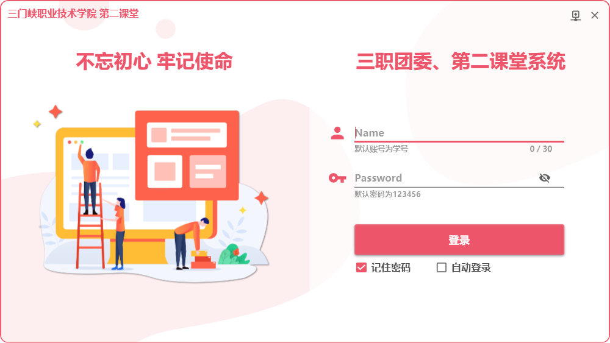
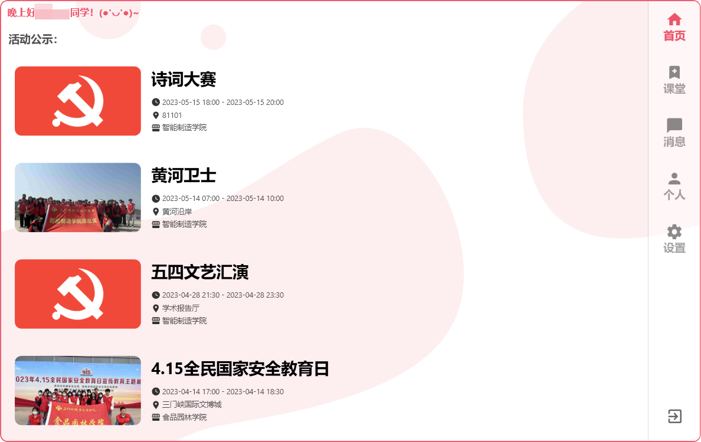
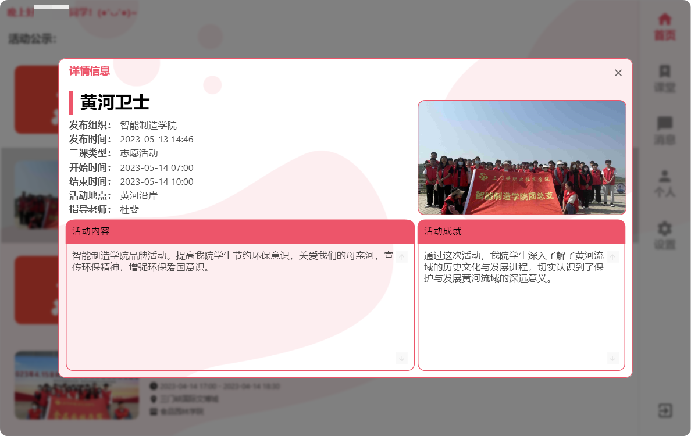
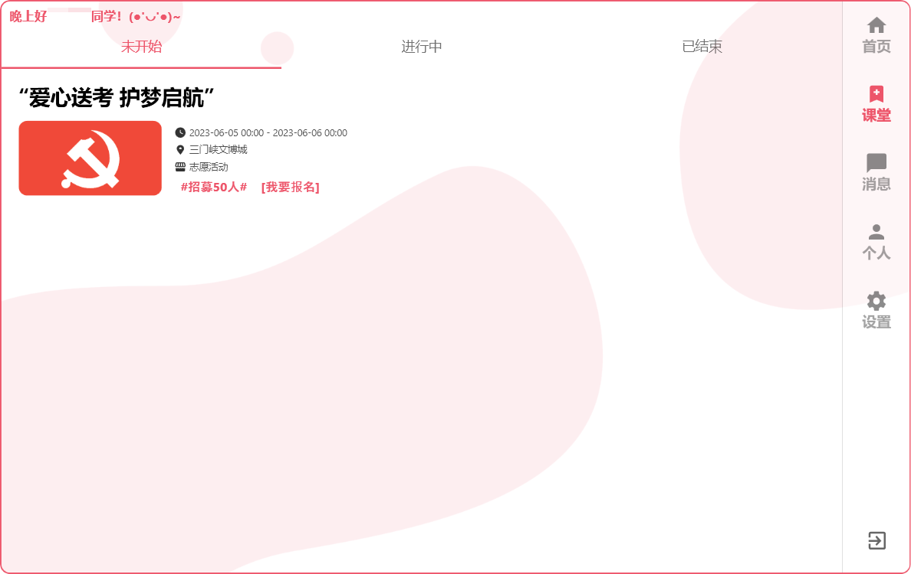
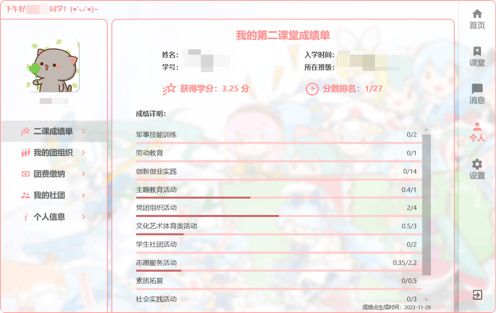

# 第二课堂客户端

## 摘要

基于WPF和.NET Framework 4.8的第三方客户端

## 界面

## 待开发功能

- [x] 基本登录功能
- [x] 首页信息获取和展示
- [x] 获取活动信息
- [x] 得到个人成绩单以及其他菜单功能
- [x] 程序个性化功能
- [x] 用户头像修改
- [ ] 团费缴纳页面
- [ ] 我的社团页面
- [ ] 个人信息修改
- [ ] 程序使用代理
- [ ] 活动报名
- [ ] 活动总结上传
- [ ] 活动签到

## 参考及应用

- **三门峡职业技术学院第二课堂**
  主页链接： [第二课堂 (smxpt.cn)](https://erke.smxpt.cn/h5/#/pages/index/login) 
  接口文档：[待完善...](./)
- **MaterialDesignThemes**
   [MaterialDesignInXAML](https://github.com/MaterialDesignInXAML/MaterialDesignInXamlToolkit) 
- **Microsoft.Xaml.Behaviors.Wpf**
  [XamlBehaviorsWpf](https://github.com/Microsoft/XamlBehaviorsWpf) 
- **Newtonsoft.Json**
   [Json.NET - Newtonsoft](https://www.newtonsoft.com/json) 
- **Portable.BouncyCastle**
   [The Legion of the Bouncy Castle C# Cryptography APIs](https://www.bouncycastle.org/csharp/) 

## 已知问题

~~2023-06-21 个人成绩单界面发生更新，导致无法显示~~ 此问题已于2023-11-29修复

## 其他

考虑到需要跨平台的特性，此版本有可能不会持续的维护下去，未来会使用.NET MAUI + MVVM重构

